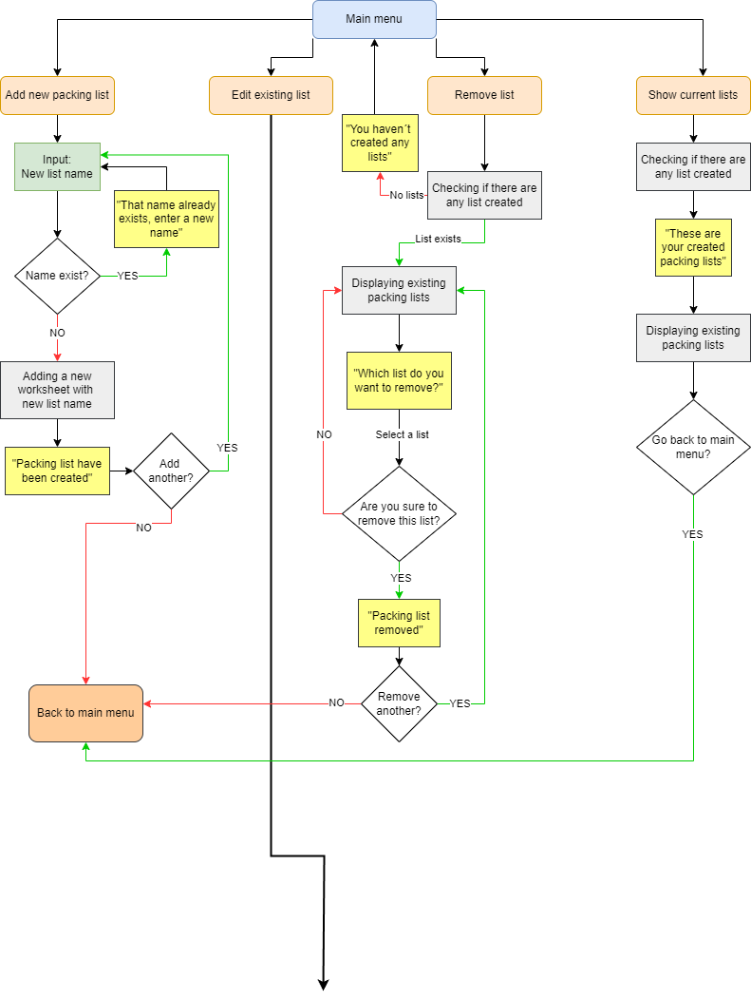
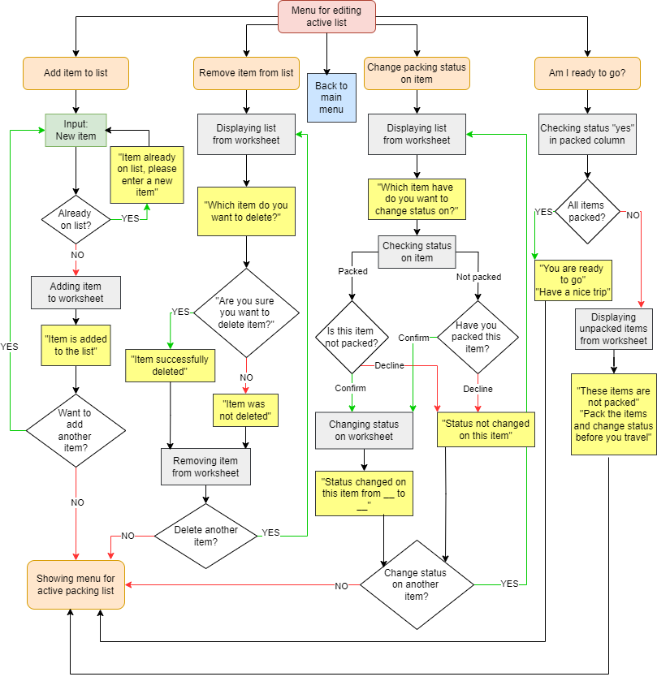

https://docs.google.com/spreadsheets/d/1AV-nZAvPqpJ5bxexeTKuvK2YJYU36GT0OuKhUHCSzzk/edit?usp=sharing - Spreadsheet

# Flowchart

### Main menu

### Editing existing list

# Testing
`Main menu` 
| Feature | Expected Outcome | Testing Performed | Result | Pass/Fail |
| --- | --- | --- | --- | --- |
| Add a new packing list | Navigated to creation page | Choosed # 1 at main menu| Got to the create packing list page | Pass |
| Delete a packing list | Navigated to delete page | Choosed # 2 at main menu | Got to the delete packing list page | Pass |
| Show all packing lists | Navigated to page where all list will be shown | Choosed # 3 at main menu | Saw all created packing lists | Pass |
| Edit existing packing list | Navigated to edit packing list page | Choosed # 4 at main menu | Got to the edit packing list page | Pass |
| Quit | Program shutting down | Choosed # 5 at main menu | Program shut down | Pass |

# Bugs
### Bugs encountered when testing
- When you created a new packing list and wanted to delete a packing list directly after, it didn´t showed the newly created packing list. - **Solution:** Update the worksheet list with "global worksheets" in the create new packing list function.
- If you typed a alphabetic character when the choice was a digit and vice versa, it did´t gave a message that it was a wrong choice. - **Solution:** Added if ____.isdigit/.isalpha to the check if choice are made with right input.
# Credits

- https://www.youtube.com/watch?v=aEIHZDv_23U - For basic structure of this application 
- https://www.w3schools.com/ - For some basic codes
- https://developers.google.com/sheets/api/guides/concepts - How to work with spreadsheets/worksheets in python