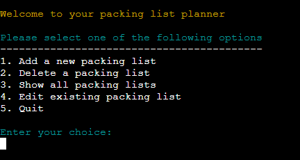
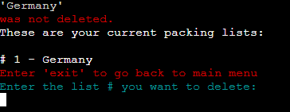
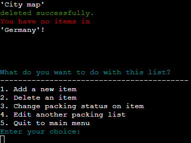
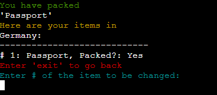
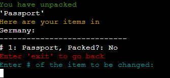
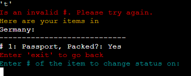
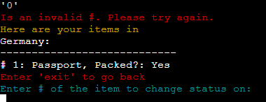

# **Packing list planner**
This packing list planner are created to help the user keep track what and what they haven´t packed before going on a trip. In this planner the user can create packing lists and add items to the lists. Multiple packing lists can be created since every list is a worksheet in the spreadsheet. While the user are packing they can come back and change packing status on the item. This will help the user keep track on what they have and haven´t packed. This planner will be available wherever you are and you can´t loose it as you can do with a paperlist.  

[Link to spreadsheet](https://docs.google.com/spreadsheets/d/1AV-nZAvPqpJ5bxexeTKuvK2YJYU36GT0OuKhUHCSzzk/edit?usp=sharing) 
[Link to application](https://projectprofessoro-7c74b3018064.herokuapp.com)

# Content
- [Developer´s goal](#developers-goal) 
- [User´s goal](#users-goal) 
- [User stories](#user-stories) 
- [Design](#design) 
- [Flowchart](#flowchart) 
- [Testing](#testing) 
- [Bugs](#bugs) 
- [Resources](#resources) 
- [Credits](#credits) 

### Developer's goal

1.	*Create a Simple Interface* 
	- Make this application easy for all users to handle, with instructions readable and very clear how to go further/backwards in every step.

2.	*Implement Core Functions*
	- Create this application with functions such as creating multiple packing lists that you can edit with: - adding items - deleting items - list all items - change packing status between "yes" and "no" 
    Other functions that can be used are: delete packing list and show all packing lists

3.	*Store Created Packing Lists*
	- Incorporate Google Sheets for managing the data that has been entered by the user. This makes the data accessible wherever the user are located. So they can keep up by adding items if something that they want to pack pops up at work or on the bus.

4.	*Easy User Experience*
	- This application is made to fit every kind of user with easy options and easy formed input validation. If something is enter invalid, messages will show what was wrong and how to enter valid data for the user.
    
5.	*Learn and Apply New Skills*
	- With this project it was a great opportunity to learn the python language. And with Google sheets API connected it was a experience to work with this data management.

### User's goal

With this application the user´s goal is to make their planning before a trip easier than using pen and paper. Papers are easy to loose and on that piece of paper could have been items they forgets to pack when leaving on a trip. Therefor this application are made to help them organize the packing before leaving on a trip. 

1.	*Organized before leaving on a trip*
	- When you have several places to visit in a short time, the user can create multiple packing list with the items for each place to visit.
	
2.	*Packing progress*
	- On every packing list the user can provide items that should be packed for each visit and change status whether the item is packed or not. So that nothing is forgotten when leaving home.

4.	*Easy to use*
	- Interaction with this application is easy since the information, validation and feedback provides helpfully to complete the tasks.
    
# User stories

### **First time visitor goals**
- When visiting this application for the first time it´s easy to understand what the functions are in this packing list planner so I can start prepare for my trips.  - ***Achived by:*** Providing the user easy navigation through all functions with validation and error messages when invalid data are entered.

### **Returning visitor goals**
- When returning to this application I can check how my packing progress are going before going to my trip. I can change status if some items are packed and also add and delete items to my existing list.  - ***Achieved by:*** The user can go in and edit a packing list and with functions as change packing status on every item, add and delete items on the list. 

### **Frequently visitor goals**
- If I´m going to prepare packing lists for multiple trips in a short time there´s an option for me to create multiple packing lists so I can keep track on every trips packing lists.  - ***Achieved by:*** Let the user add additional packing list and add items to each and every single packing list with their unique items.

# Design

### Colorscheme

- For this application I´ve tried to have the same color to the similar information. Here is how I have used the colors:

**Cyan** 
This color are applied to: - the input questions - descriptions on how to enter the data

**Green** 
This color are applied to: - messages that confirms decisions that where made (adding items/packing lists, changing status and deletion of items/packing lists)

**Red** 
This color are applied to: - error messages when data entered invalid - guidance on how the user exits when they don´t want to enter any data

**Yellow** 
This color are applied to:  - the welcome and goodbye text of this application - The guidance to the user which packing list they are editing - The question when they are going to confirm a deletion of an item or a packing list

**White** 
This color are applied to: - the options of every menu - the items and packing lists when they are listed

# Flowchart
These are the flowcharts that was created before starting this project and are the blueprints for this planner. 
### Main menu

### Editing existing list

# Testing
`Main menu` 
| Feature | Expected Outcome | Testing Performed | Result | Pass/Fail |
| --- | --- | --- | --- | --- |
| Add a new packing list | Navigated to creation page | Choosed # 1 at main menu| Got to the create packing list page | Pass |
| Delete a packing list | Navigated to delete page | Choosed # 2 at main menu | Got to the delete packing list page | Pass |
| Show all packing lists | Navigated to page where all list will be shown | Choosed # 3 at main menu | Saw all created packing lists | Pass |
| Edit existing packing list | Navigated to edit packing list page | Choosed # 4 at main menu | Got to the edit packing list page | Pass |
| Quit | Program shutting down | Choosed # 5 at main menu | Program shut down | Pass |

`Create a packing list` 
| Feature | Expected Outcome | Testing Performed | Result | Pass/Fail |
| --- | --- | --- | --- | --- |
| Create a list | Successfully add a list and a worksheet will be added in spreadsheet | Created a list called "Germany" | "Germany" was created as a worksheet | Pass |
| Create a list with existing name | A message shall tell me that the title already exists | Created "Germany" again | Message told me that "Germany" already exists | Pass |
| Create a list longer than 20 characters | A message shall tell me that the name is too long | Created a list called "GermanyGermanyGermanyGermany" | Message told me that it´s too long | Pass |
| Create list with special characters | A message shall tell me to only use alphabetic characters | Created a list called "Germany!" | Message told me to only use alphabetic characters | Pass |
| Create a list with digits | A message shall tell me to only use alphabetic characters | Created "Germany1" | A message told me to only use alphabetic characters | Pass |

`Deleting a packing list` 
| Feature | Expected Outcome | Testing Performed | Result | Pass/Fail |
| --- | --- | --- | --- | --- |
| Delete an existing packing list | Delete chosen # list and confrimed | Chosed to delete # 2 and confirmed | The chosed packing list was deleted | Pass |
| Declining a deletion | When declining a deletion, the packing list shall not be deleted | 
| Trying to delete a # that doesn´t exist | A message shall tell me that # doesn´t exist | Tried to delete # 0 | Message told me that # 0 was not an option | Pass |
| Deleting the last existing packing list | Menu shall shown that no packing list exists | Deleted the last packing list | Message told me there are no more packing lists and menu with options shown | Pass |

`Adding items to packing list` 
| Feature | Expected Outcome | Testing Performed | Result | Pass/Fail |
| --- | --- | --- | --- | --- |
| Adding an item | Item successfully added to list and shows up on worksheet in with 'No' in second column | Added "Passport" | "Passport" was created and showed up with "No" in second column | Pass |
| Adding same item that exists | A message shall tell me that the item already exists on the list | Adding "Passport" again | Message told me that "Passport" already exists | Pass |
| Adding item with special characters | A message shall tell me to only use alphabetic characters | Adding "Passport!" | A message told me to only use alphabetic characters | Pass |
| Adding item with digits | A message shall tell me to only use alphabetic characters | Adding "Passport1" | A message told me to only use alphabetic characters | Pass |

`Deleting items from packing list` 
| Feature | Expected Outcome | Testing Performed | Result | Pass/Fail |
| --- | --- | --- | --- | --- |
| Delete an item | When deleting an item, a confirmation question shall be shown. When confirmed the item shall be deleted | Delete "Toothpaste" and confirmed | After confirmation a message shown that "Toothpaste" was deleted and it disappeared from the list | Pass |
| Declining deletion of an item | When you declining a deletion of an item, the item shall not be deleted and you get back to edit menu | Declining deletion of "City map" | When declined the deletion of "City map" a message shown that the item wasn´t deleted and got back to edit menu | Pass |
| Delete an index not existing | When trying to delete an index not shown in list a message shall tell me that index doesn´t exist | Tried deleting #7 and 't' | Message told me that #7 and 't' was a invalid input | Pass |
| Deleting the last item | When deleted the last item a message shall tell me that there are no items in the packing list | Deleted all items | A message told me that there are no items in the packing list | Pass |

`Changing packing status on item` 
| Feature | Expected Outcome | Testing Performed | Result | Pass/Fail |
| --- | --- | --- | --- | --- |
| Changing from 'No' to 'Yes' | When changing status a message shall tell me that the item has been packed | Changed "Passport" status | A message told me that the item has been packed and it changed 'No' to 'Yes' | Pass |
| Changing from 'Yes' to 'No' | When changing status a message shall tell me that the item has been unpacked | Changed "Passport" status | A message told me that the item has been unpacked and changed 'Yes' to 'No' | Pass |
| Enter wrong choices | When enter wrong choices a message shall tell me that wrong choice has been made | Entered wrong index in different kinds ('t', '0', '!') | Message told me that the value entered is invalid | Pass |
| Change item when packing list is empty | When chosing to change status on an empty packing list you will brought back to edit menu | Tried to change status on empty list | Brought back to edit menu page and it says that I don´t have any items on the list | Pass |

# Bugs
### Bugs encountered when testing
- When you created a new packing list and wanted to delete a packing list directly after, it didn´t showed the newly created packing list. - **Solution:** Update the worksheet list with "global worksheets" in the create new packing list function.
- If you typed a alphabetic character when the choice was a digit and vice versa, it did´t gave a message that it was a wrong choice. - **Solution:** Added `if ____.isdigit/.isalpha` to the check if choice are made with right input.
- If you wanted to delete an item even if there wasn´t any in the list, the question which # to delete still showed up. - **Solution:** Added `if not items_list:` to see if there are any items added to the list.
- If there are no items to be changed, it still asked which item to be changed. - **Solution:** added `if len(items_list) == 0:` before asking which item that shall be changed.
# Resources

- https://www.youtube.com/watch?v=aEIHZDv_23U - For basic structure of this application. 
- https://www.w3schools.com/ - Learning the meaning of the python codes. 
- https://developers.google.com/sheets/api/guides/concepts - How to work with spreadsheets/worksheets in python 
- https://pep8ci.herokuapp.com/# - Validation of the python code. 
- https://www.flake8rules.com/ - Helping me with errors in "Python Linter". 
- https://www.geeksforgeeks.org/clear-screen-python/ - How to use the clear function 
- https://pypi.org/project/colorama/ - Colorama library 
- https://medium.com/@adheremo65/what-is-the-main-block-in-python-if-name-main-d9f7410ef2f2#:~:text=Why%20do%20we%20need%20to,a%20module%20into%20another%20script - How to use main block function 
- https://www.tutorialspoint.com/python/python_strings.htm - How to use `.isdigit`and `.isalpha` 

# Credits 

- Rohit Sharma - My mentor
- [Jaqi´s Readme](https://github.com/JaqiKal/task-master?tab=readme-ov-file#objectives) - This helped me write this Readme.