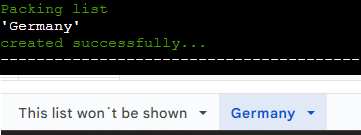
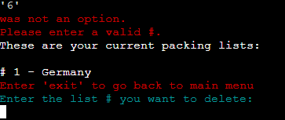

https://docs.google.com/spreadsheets/d/1AV-nZAvPqpJ5bxexeTKuvK2YJYU36GT0OuKhUHCSzzk/edit?usp=sharing - Spreadsheet 
https://projectprofessoro-7c74b3018064.herokuapp.com/ - Live page
# Flowchart
These flowchart was created before I started and are the blueprints I´ve worked after. 
### Main menu

### Editing existing list

# Testing
`Main menu` 
| Feature | Expected Outcome | Testing Performed | Result | Pass/Fail |
| --- | --- | --- | --- | --- |
| Add a new packing list | Navigated to creation page | Choosed # 1 at main menu| Got to the create packing list page | Pass |
| Delete a packing list | Navigated to delete page | Choosed # 2 at main menu | Got to the delete packing list page | Pass |
| Show all packing lists | Navigated to page where all list will be shown | Choosed # 3 at main menu | Saw all created packing lists | Pass |
| Edit existing packing list | Navigated to edit packing list page | Choosed # 4 at main menu | Got to the edit packing list page | Pass |
| Quit | Program shutting down | Choosed # 5 at main menu | Program shut down | Pass |

`Create a packing list` 
| Feature | Expected Outcome | Testing Performed | Result | Pass/Fail |
| --- | --- | --- | --- | --- |
| Create a list | Successfully add a list and a worksheet will be added in spreadsheet | Created a list called "Germany" | "Germany" was created as a worksheet | Pass |
| Create a list with existing name | A message shall tell me that the title already exists | Created "Germany" again | Message told me that "Germany" already exists | Pass |
| Create a list longer than 20 characters | A message shall tell me that the name is too long | Created a list called "GermanyGermanyGermanyGermany" | Message told me that it´s too long | Pass |
| Create list with special characters | A message shall tell me to only use alphabetic characters | Created a list called "Germany!" | Message told me to only use alphabetic characters | Pass |
| Create a list with digits | A message shall tell me to only use alphabetic characters | Created "Germany1" | A message told me to only use alphabetic characters | Pass |

`Deleting a packing list` 
| Feature | Expected Outcome | Testing Performed | Result | Pass/Fail |
| --- | --- | --- | --- | --- |
| Delete an existing packing list | Delete chosen # list and confrimed | Chosed to delete # 2 and confirmed | The correct packing list was deleted | Pass |
| Trying to delete a # that doesn´t exist | A message shall tell me that # doesn´t exist | Tried to delete # 0 | Message told me that # 0 was not an option | Pass |
| Deleting the last existing packing list | Menu shall shown that no packing list exists | Deleted the last packing list | Message told me there are no more packing lists and menu with options shown | Pass |

`Adding items to packing list` 
| Feature | Expected Outcome | Testing Performed | Result | Pass/Fail |
| --- | --- | --- | --- | --- |
| Adding an item | Item successfully added to list and shows up on worksheet in with 'No' in second column | Added "Passport" | "Passport" was created and showed up with "No" in second column | Pass |
| Adding same item that exists | A message shall tell me that the item already exists on the list | Adding "Passport" again | Message told me that "Passport" already exists | Pass |
| Adding item with special characters | A message shall tell me to only use alphabetic characters | Adding "Passport!" | A message told me to only use alphabetic characters | Pass |
| Adding item with digits | A message shall tell me to only use alphabetic characters | Adding "Passport1" | A message told me to only use alphabetic characters | Pass |

`Deleting items from packing list` 
| Feature | Expected Outcome | Testing Performed | Result | Pass/Fail |
| --- | --- | --- | --- | --- |
| Delete an item | When deleting an item, a confirmation question shall be shown. When confirmed the item shall be deleted | Delete "Toothpaste" and confirmed | After confirmation a message shown that "Toothpaste" was deleted and it disappeared from the list | Pass |
| Declining deletion of an item | When you declining a deletion of an item, the item shall not be deleted and you get back to edit menu | Declining deletion of "City map" | When declined the deletion of "City map" a message shown that the item wasn´t deleted and got back to edit menu | Pass |
| Delete an index not existing | When trying to delete an index not shown in list a message shall tell me that index doesn´t exist | Tried deleting #7 and 't' | Message told me that #7 and 't' was a invalid input | Pass |

# Bugs
### Bugs encountered when testing
- When you created a new packing list and wanted to delete a packing list directly after, it didn´t showed the newly created packing list. - **Solution:** Update the worksheet list with "global worksheets" in the create new packing list function.
- If you typed a alphabetic character when the choice was a digit and vice versa, it did´t gave a message that it was a wrong choice. - **Solution:** Added `if ____.isdigit/.isalpha` to the check if choice are made with right input.
- If you wanted to delete an item even if there wasn´t any in the list, the question which # to delete still showed up. - **Solution:** Added `if not items_list:` to see if there are any items added to the list.
# Resources

- https://www.youtube.com/watch?v=aEIHZDv_23U - For basic structure of this application. 
- https://www.w3schools.com/ - Learning the meaning of the python codes. 
- https://developers.google.com/sheets/api/guides/concepts - How to work with spreadsheets/worksheets in python 
- https://pep8ci.herokuapp.com/# - Validation of the python code. 
- https://www.flake8rules.com/ - Helping me with errors in "Python Linter". 
- https://www.geeksforgeeks.org/clear-screen-python/ - How to use the clear function 
- https://pypi.org/project/colorama/ - Colorama library 
- https://medium.com/@adheremo65/what-is-the-main-block-in-python-if-name-main-d9f7410ef2f2#:~:text=Why%20do%20we%20need%20to,a%20module%20into%20another%20script - How to use main block function 
- https://www.tutorialspoint.com/python/python_strings.htm - How to use `.isdigit`and `.isalpha` 

# Credits 

- Rohit Sharma - My mentor
